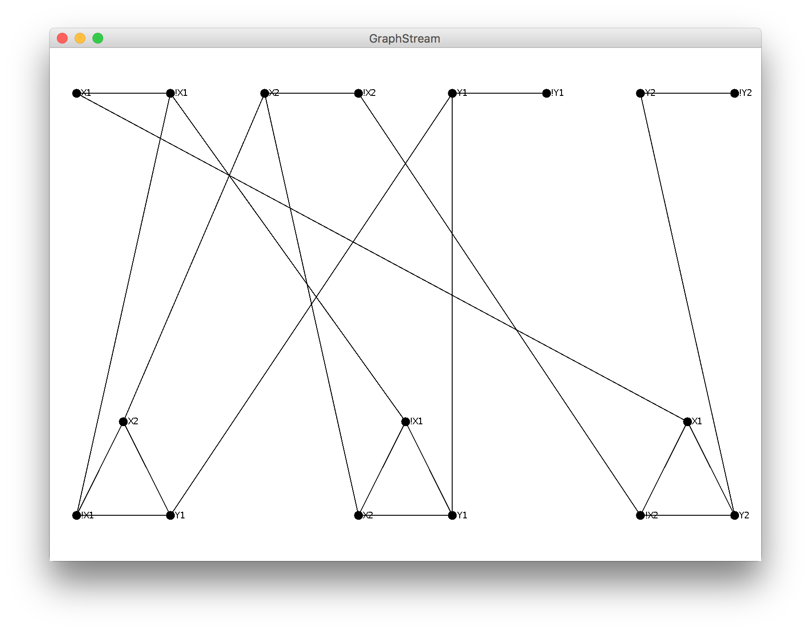

# <center>Complejidad Computacional
## <center>Práctica Módulo 2: Vextex Cover (GUI)
#### <center>Pedro Miguel Lagüera Cabrera (alu0100891485)
---
> Sintaxis Válida de Cláusula:

```
([!]?\w\d ^ [!]?\w\d ^ [!]?\w\d)
```

> Sintaxis Válida de Tripleta:

```
Cláusula ^ Cláusula ^ Cláusula
```
> Ejemplo:

```
(!X1 ^ X2 ^ Y1) ^ (X2 ^!X1 ^ Y1) ^ (!X2 ^ X1 ^ Y2)
```

